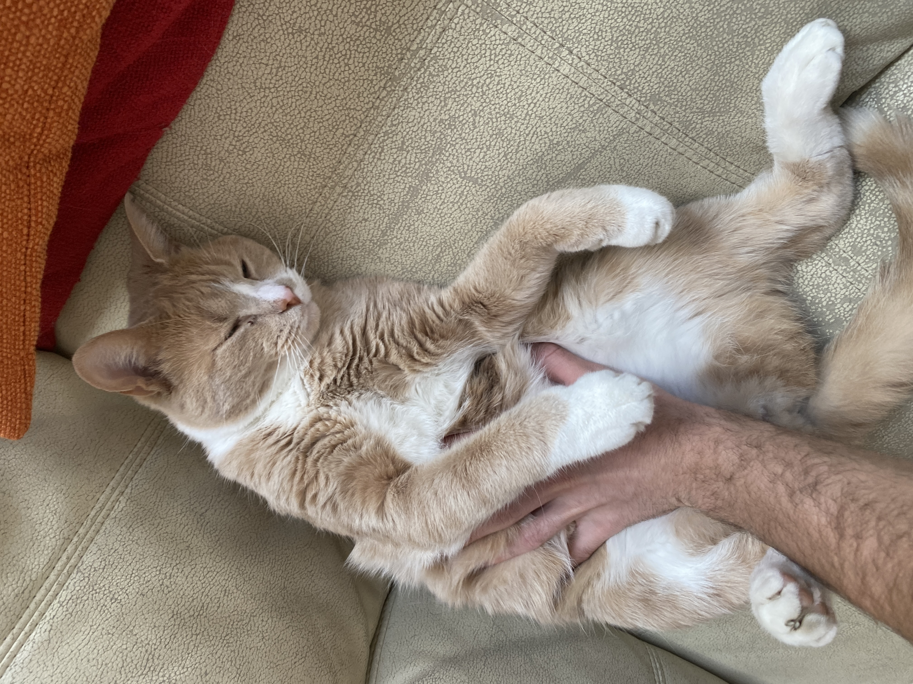
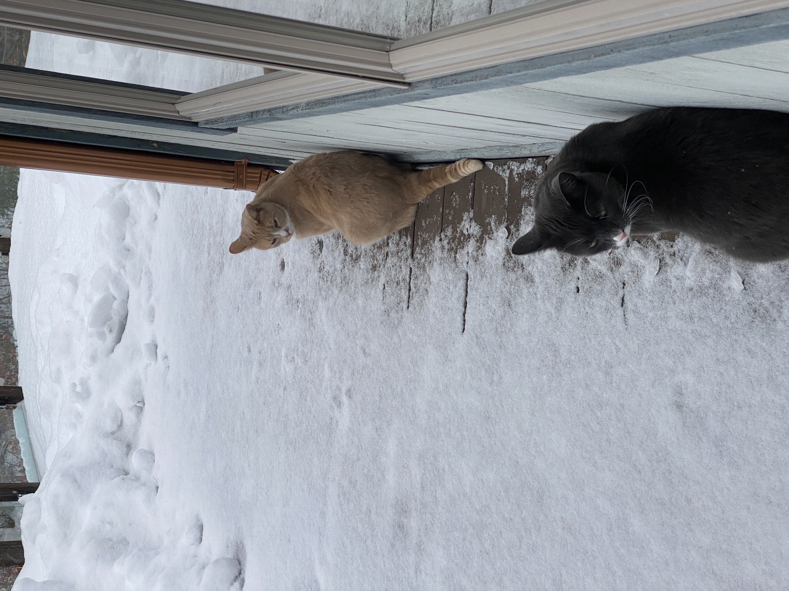

# Homework 1 Markdown Script Test

## Remi Savard

### MCB 536A: TFCB_2023

#### <ins>Goals<ins>

Demonstrate: 
1. *Headers*
2. *Lists*
3. *Embedded Images*
4. *Tables*

#### <ins>Cool Images You Should Probably See<ins>

First, here's a picture from my recent hiking trip on the Ptarmigan Traverse in the North Cascades.

Second, it's critical that you meet my cats, Pebbles (colloquially termed 'Peebs') and Theodore (aka 'Teetee Bear').

#### <ins>Finally, Some Tables (in *tidy*, of course)<ins>

People in Remi's Life
| Person | Relationship|  Interest |  Favorite Cat |
|-----|-------|-----|-------|
|  Isabelle |  Girlfriend | Art |  Peebs |
|  Liliane | Mom  |  Autism Research | Toutina (not shown) |
| Arthur | Dad | Kayaking | None :( |
| Andre | Lil Brother | Ultimate Frisbee | Peebs |
| Maxine | Lil Sister | Shopping | Peebs |
| Dominique | Lil Sister | Farming | Peebs |

##

# *The End*
